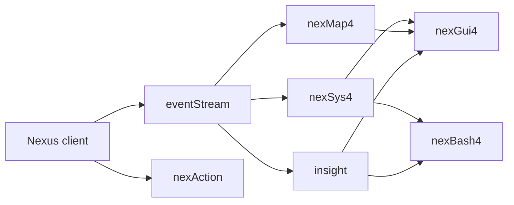

# Ecosystem architecture

Version 4 is a collection of cooperating packages rather than one indivisible
system. Each package owns a focused domain and exposes a deliberately small
public boundary.

## Design principles

- **Own one domain.** Character state belongs to nexSys; mapping belongs to nexMap.
- **Communicate through contracts.** Public events and APIs are integration boundaries.
- **Keep dependencies explicit.** Optional integrations should remain optional.
- **Prefer snapshots over internals.** Consumers read published state rather than reaching into stores.
- **Document with the code.** Each Version 4 repository owns its public documentation content.

The nexFiles site supplies navigation and presentation. Package documentation
is loaded directly from each package repository so it can evolve in the same
change as the code it describes.
