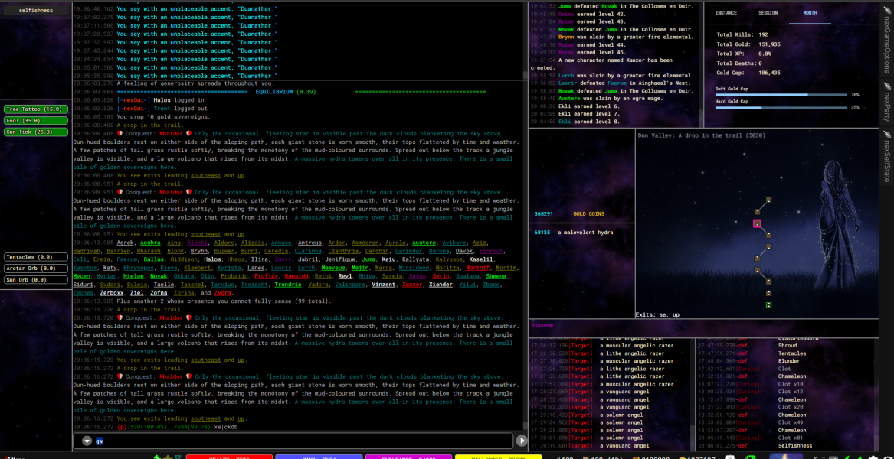

nexGui is a full visual UI package for the Nexus client. It adds a suite of custom tabs, live overlays, and stream panels that turn GMCP and eventStream data into a polished, usable combat HUD.

## What you get

- A full set of custom tabs for room inventory, NPCs, players, timers, streams, and stats.
- A configurable theme engine with background images, opacity, hue shifts, and font sizing.
- Live system and combat streams powered by eventStream.
- Party management tools and target tracking visuals.
- An optional infinite display renderer with virtualized logs and buffer search.

## Requirements

- Nexus web client (official).
- eventStream (required dependency).
- nexAction (required for triggers and replacements).

Optional integrations:

- nexSys for message replacement and damage number parsing.
- nexMap for wormhole exit enhancements.
- insight for target limb state display.

## Architecture overview

nexGui injects custom React tabs into the Nexus flex layout. It maintains a global `nexGui` object that stores settings, streams, timers, and UI helpers. Tabs are defined in `base/tabs` and rendered with overrides in `base/startup`.

Key modules:

- `base/startup`: layout wiring, overrides, and initialization.
- `base/tabs`: tab registry and React overrides.
- `base/events`: eventStream integration and system streams.
- `base/virtual`: infinite buffer and renderer override.
- `base/colors`: ally/enemy formatting and room text replacement.

## Version

Current package version is `2.9.0x` (see `nexGui.version`).
