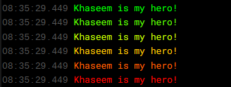

import Link from "@docusaurus/Link";

# Useful Code Snippets

A collection of useful code snippets for and from the community for use in Nexus.

## Playing sounds

```js
// How to play built in Nexus sounds
nexusclient.ui().sounds().play_sound("sfx/alarm beep 2");
// List of built in sounds
console.log(nexusclient.ui().sounds().sounds_list);
```

## Simple Color gradients

A percentage based gradient from 0 to 100%; red to green. Often used for display of health.



```js
//style="color:hsl(${<perc>*1.2}, 100%, 50%)"

//Example usage
nexusclient.add_html_line(
  `<span style="color:hsl(${100 * 1.2}, 100%, 50%)">Khaseem is my hero!</span>`
);
nexusclient.add_html_line(
  `<span style="color:hsl(${80 * 1.2}, 100%, 50%)">Khaseem is my hero!</span>`
);
nexusclient.add_html_line(
  `<span style="color:hsl(${60 * 1.2}, 100%, 50%)">Khaseem is my hero!</span>`
);
nexusclient.add_html_line(
  `<span style="color:hsl(${40 * 1.2}, 100%, 50%)">Khaseem is my hero!</span>`
);
nexusclient.add_html_line(
  `<span style="color:hsl(${20 * 1.2}, 100%, 50%)">Khaseem is my hero!</span>`
);
nexusclient.add_html_line(
  `<span style="color:hsl(${1 * 1.2}, 100%, 50%)">Khaseem is my hero!</span>`
);
```

## Advanced Color gradients


```js
/** We create a function to create a reusable snippet for gradients
This function can be placed in an onload function block to be available
when needed */
const gradientText = (txt, colors, size = "") => {
  nexusclient.add_html_line(
    `<span style="background: -webkit-linear-gradient(left, ${colors.join(
      ","
    )});-webkit-background-clip: text;-webkit-text-fill-color: transparent;font-size: ${size}px">${txt}</span>`
  );
};

// Example usage
// <colors> is an array of color names to transition through
// <size> is the font size in pixels
gradientText(
  "What an amazing example of color gradients in HTML. Khaseem is my hero!",
  ["red", "green", "blue", "white"],
  16
);
```

## Custom Tabs

```js
// Check if a custom tab exists, and if not, create it!
if (!nexusclient.ui().layout().tab_location(<tab name>)) {
  nexusclient.ui().layout().register_custom_tab(<tab name>);
}
```

:::note
Refer to the Nexus client <Link to="../nexus/API">API</Link> commands for how to interact with custom tabs.
:::

## Client Style Overrides

```js
// Khaseem's preferences on a few general GUI changes
const initializeLayout = () => {
  const model = nexusclient.ui().layout().model();
  // Resize the splitter width
  model.global.splitterSize = 2;
  // Change the color of the splitter bars
  const sty = document.createElement("style");
  sty.setAttribute("id", "nexGuicss");
  sty.innerHTML =
    ".flexlayout__splitter {background-color: grey;} " +
    ".flexlayout__tab {background-color: #000!important} " +
    ".output {padding: 5px} ";
  document.querySelector("head").appendChild(sty);
};

initializeLayout();
```
