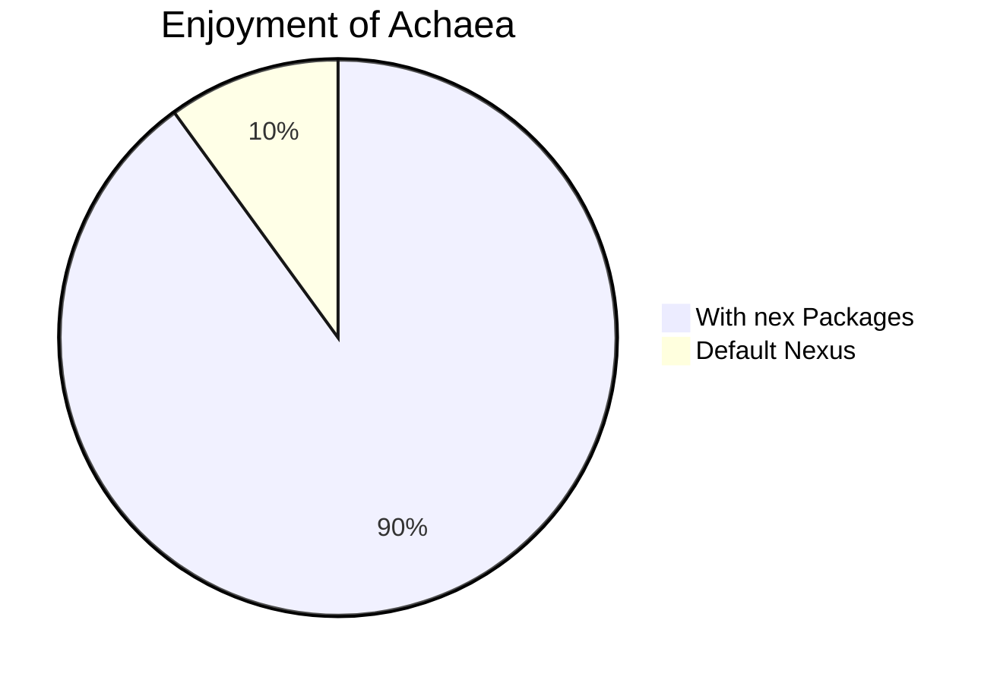

# Tutorials

New player guides on how to configure basic Nexus features. These tutorials will not cover simplified scripting.

It is the opinion of this organization that new players are better in the long run learning the JavaScript approach to Nexus features. Many users are initially scared by the word JavaScript but often times it can be a much more simple solution than simplified scripting.

## Triggers

## Aliases

## Variables

## Functions
