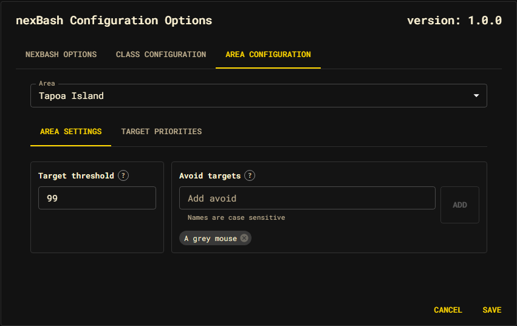
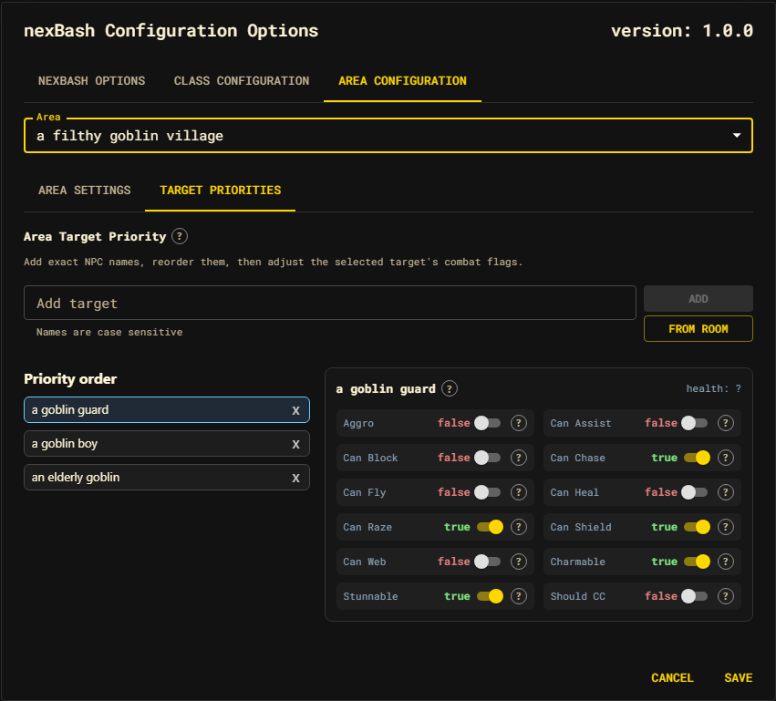

# Area Configuration

The **Area Configuration** tab configures settings and target priorities for each area. It contains two sub-tabs: **Area Settings** and **Target Priorities**.

## Choosing the area

The **Area** dropdown at the top of the tab selects which area you are editing. It defaults to the area matching your current GMCP location and falls back to the first registered area. Each area's settings are independent.

To add a brand-new area, walk to it in-game and use `nb addarea` (see [Commands](../commands.md)); it then appears in this dropdown.

---

## Area Settings

The **Area Settings** sub-tab configures threshold limits and target exclusion for the selected area:

- **Target Threshold** — The maximum number of targets to engage in a single room of this area before moving on (defaults to 5).
- **Avoid Targets** — A list of specific NPC names. If any of these NPCs are present in a room, nexBash will skip that room entirely. To add an avoid target, type its name and press Add.

---

## Target Priorities

The **Target Priorities** sub-tab configures which mobs nexBash engages and in what order — and how it treats each one in combat.

### Building the priority list

Targets are tried **top to bottom** for the selected area. Three ways to add one:

- **Add target** — type an exact, **case-sensitive** in-game name and press Add.
- **From room** — pick from a menu of the NPCs currently visible in your room
  (corpses and your own character are filtered out; duplicates show a count).
- Drag entries in the **Priority order** list to reorder them.

Select an entry to edit its NPC flags; delete an entry with its remove control.

### NPC combat flags

Each target carries combat flags saved as **area-specific overrides**. They tell
combat and target-selection logic how to treat that mob. Toggle them on the
selected target:

| Flag | Meaning |
| --- | --- |
| **Aggro** | Treat this NPC as aggressive when selecting or skipping targets. |
| **Can Assist** | This NPC can join fights already in progress. |
| **Can Block** | This NPC can block movement or escape paths. |
| **Can Chase** | This NPC may follow after you leave the room. |
| **Can Fly** | This NPC can follow or attack in flight-relevant rooms. |
| **Can Heal** | This NPC can heal itself or others (gates abilities like scorch). |
| **Can Raze** | This NPC can remove your shield defence. |
| **Can Shield** | This NPC can raise a shield that affects action choice. |
| **Can Web** | This NPC can web — drives morimbuul pre-draw and safety logic. |
| **Charmable** | This NPC can be affected by charm-style control. |
| **Stunnable** | This NPC can be affected by stun-style control. |
| **Should CC** | Prefer crowd-control actions against this NPC when available. |

The selected target's estimated **health** (`totalHp`) is shown next to its name.
A target in the list with no stored data shows an empty flag panel until you set
flags or nexBash discovers data about it during combat.

### Discovered data

Some facts are learned automatically rather than configured. As nexBash fights, it
probes mob **damage types** and **resistances** and records them on the area's NPC
entry, so later runs avoid resisted attacks. These discoveries are reported at the
end of a run and persisted with the area. See [Areas](../areas.md) and
[Session & automations](../session-and-automations.md).

### Saving

Like the other tabs, edits are a draft until you press **Save**. After saving,
run `nb clear` so a live run reloads the area and picks up your changes.
