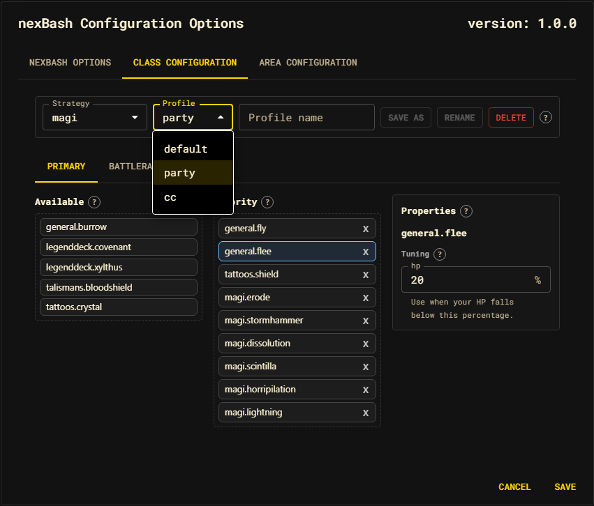

# Class Configuration

The **Class Configuration** tab is where you shape what your class does in combat:
the order it tries abilities, which abilities are even in play, any per-class
knobs, and the named [profiles](../profiles.md) you switch between.

## Strategy toolbar

The toolbar across the top selects what you are editing:

| Control | Purpose |
| --- | --- |
| **Strategy** | The class whose priorities you are editing. Defaults to your current class. |
| **Profile** | The named variant being edited. Always edits the **active** profile. |
| **Profile name** + **Save as** | Fork the current edits into a new named profile. |
| **Rename** / **Delete** | Rename or remove the active profile (the implicit `default` is protected). |
| **⚙ Settings** | A popover of per-class knobs — only shown for classes that ship them. |

Switching strategy or profile folds your in-progress edits back into their profile
first, so nothing is lost when you move between them.

## Priority lanes

Below the toolbar are the lane editors, one per sub-tab:

- **Primary** — the main attack lane.
- **Battlerages** — the battlerage lane (only shown for classes with one).

Each lane editor has three columns:

| Column | Meaning |
| --- | --- |
| **Available** | Actions your class *can* use that are not currently in the priority. The "bench." |
| **Priority** | The evaluated order, top to bottom. Position 1 is tried first. |
| **Properties** | Tuning for the selected action (when it exposes any). |

Drag an action from **Available** into **Priority** to add it; drag it back to
remove it. Reorder within **Priority** to change which ability is tried first.

The order **is** the membership: an action in the Priority column is evaluated; an
action on the bench is available but not in play. There is no separate "disabled"
checkbox. Because a customized lane owns its order, a future nexBash update that
ships a new ability surfaces it on your bench rather than injecting it into your
priority unannounced.

## How priority actually resolves

The Priority column is an *order of preference*, not a fixed script. Each prompt,
nexBash walks the lane top-to-bottom and uses the **first** action whose
situational gate passes right now — so a high-priority ability that isn't legal
this instant (no balance, wrong target state, resisted damage type) is simply
skipped in favor of the next valid one. See [the decision model](../decision-model.md)
for exactly how that works.

## Class settings

Some classes expose bool/int **knobs** beyond ability order (for example a
threshold that changes when an ability kicks in). These live behind the
**⚙ Settings** popover and are part of the profile delta — they save and switch
with the profile like everything else.

## Saving

All edits stay in the draft until you press **Save** on the dialog. On save,
nexBash builds the **minimal delta** over the shipped class defaults — only the
lanes, params, and action args you actually changed are stored — and persists it
under the active profile. See [Strategies](../strategies.md) and
[Profiles](../profiles.md).
