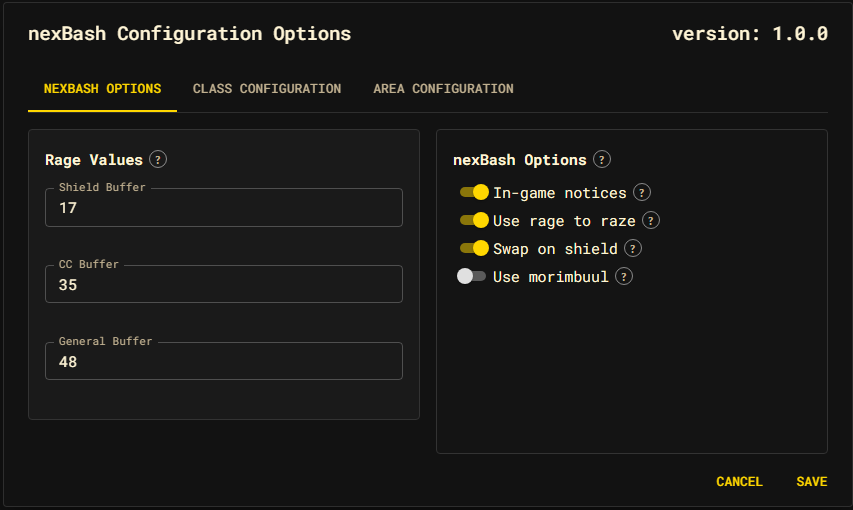

# nexBash Options

The **nexBash Options** tab has two panels: the global behavior toggles and the
battlerage rage reserves.

## Options

Each toggle edits the draft only; **Save** applies it to the runtime and the
persisted settings. Defaults shown.

| Option | Default | Effect |
| --- | --- | --- |
| In-game notices | On | Show nexBash status notices (target swaps, area-cleared, `nb` output) in the client. |
| Use rage to raze | On | Spend battlerage to raze a target's shield instead of waiting it out. |
| Swap on shield | On | When the current target raises a shield, switch to another valid target. |
| Use morimbuul | On | Draw morimbuul before engaging mobs flagged as able to web you. |

These map to `nexBash.options.{notices, rageToRaze, swapOnShield, useMorimbuul}`.
The dev-only `logging` flag exists in the option set but is intentionally not
surfaced in the dialog. See the [Options reference](../../reference/options.md).

## Rage Values

The three reserves control how much battlerage nexBash keeps in hand before each
category of rage is allowed to spend. A reserve is a rage threshold, not a cost.

| Field | Default | Reserve for |
| --- | --- | --- |
| Shield Buffer | 17 | A shield raze. |
| CC Buffer | 35 | A crowd-control rage. |
| General Buffer | 48 | General battlerage. |

Values must be numbers ≥ 0; invalid input is shown inline and is not written to
the draft. These map to `nexBash.config.battlerage.{shieldBuffer, ccBuffer,
generalBuffer}`. For how the reserves gate rage selection, see
[Battlerage](../battlerage.md).
