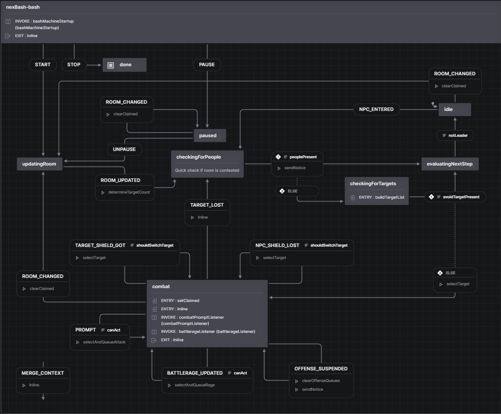

# nexBash4

nexBash4 is a bashing-automation system for Achaea that runs inside the Nexus web
client. It scans each room for valid targets, selects
the optimal attack and battlerage on every game prompt, and keeps you safe while
it grinds — all driven by the live character state it reads from nexSys4.

Version 4 is a ground-up rebuild on [XState v5](https://stately.ai/docs/xstate).
Its public contract is deliberately small and predictable:

```text
nexBash
|-- state     frozen, serializable snapshot
|-- api       domain-oriented functions
`-- options   persisted player option flags
```

It is not a drop-in rename of nexBash3. The decision engine, state model, and
configuration UI are all new.

## The state machine

At the core of nexBash4 is an XState v5 state machine (`nexbash-bash`) that manages the high-level execution flow. It orchestrates transitions between updating room facts, checking for other players, selecting targets, active combat prompts, pathing to the next room, and pausing:



## What it does

- **Tracks areas** — matches your location to a registered area to apply custom targets and priorities.
- **Selects targets** — builds the room's combatant list, ranks it by your
  per-area priority order, and engages the best one.
- **Chooses attacks** — evaluates a curated, per-class priority lane on every
  prompt and queues the first ability that is legal to use right now.
- **Drives battlerage** — runs a parallel battlerage lane, spending rage on
  razes, crowd control, and damage within configured reserves.
- **Keeps you safe** — flies, flees, shields, razes, swaps off shielded targets,
  and runs effect automations (bloodcloak, morimbuul, and more).
- **Discovers mob data** — probes damage types and resistances during combat and
  remembers them per area.
- **Scores the run** — tracks kills, gold, and elapsed time, and reports a
  summary when a run ends.

## How it relates to nexSys4

nexBash4 is a layer on top of [nexSys4](../nexSys/introduction.md). nexSys4 owns
character state, curing, and command queues; nexBash4 reads that state and uses
those queues to fight. You must have nexSys4 installed and running for nexBash4
to work. See [Installation](./getting-started/installation.md).

## Supported classes

nexBash4 ships a combat **strategy** for each supported class. Out of the box
that set is: **Magi**, **Occultist**, **Red Dragon**, **Blue Dragon**, **Golden
Dragon**, and **Fire Lord**. nexBash4 selects the strategy for your class
automatically; an unsupported class still navigates and selects targets, but
without class attacks. Type `nb help` to see the live supported set.

## Where to begin

New users should follow [Installation](./getting-started/installation.md) and
then the [Quickstart](./getting-started/quickstart.md). The
[Guides](./guides/index.md) explain the configuration UI, how nexBash decides
what to do, and the area/strategy/profile model.

Package authors and advanced users can start at the
[Reference overview](./reference/index.md).
