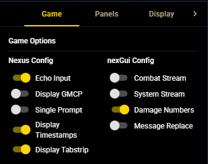
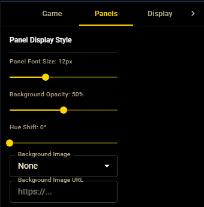
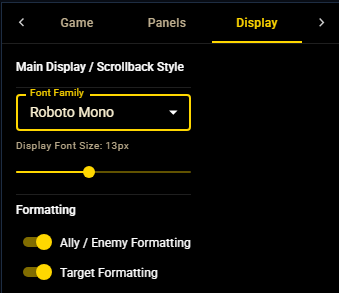
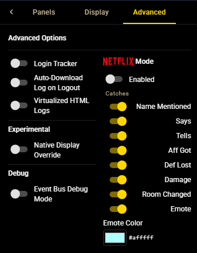

# Options

The **Options** panel (`nexOptions`) groups every configurable setting into four
tabs. Settings persist per character; the active Options tab is remembered
between sessions.

## Game

The Game tab has two columns.

**Nexus Config** drives the host client's own settings:

| Setting | Effect |
| --- | --- |
| Echo Input | Mirror your typed commands into the game output. |
| Display GMCP | Show inbound GMCP payloads in the output stream. |
| Single Prompt | Collapse the duplicate Nexus prompt into a single prompt line. |
| Display Timestamps | Show Nexus timestamps in the main output. |
| Display Tabstrip | Show the FlexLayout tab strip for docked tabs. |

**nexGui Config** drives nexGui4 behavior:

| Setting | Effect |
| --- | --- |
| Combat Stream | Route combat messages to the [Combat side stream](./streams.md). |
| System Stream | Route system messages to the [System side stream](./streams.md). |
| Damage Numbers | Show damage-number overlays on combat output. |
| Message Replace | Apply structured replacement rows for skill actions. |

## Panels

The Panels tab styles the docked panels (not the game display):

| Control | Range / values |
| --- | --- |
| Panel Font Size | 8–20 px |
| Background Opacity | 0–100% |
| Hue Shift | 0–360° |
| Background Image | None, a built-in preset, or a custom image URL |

## Display

The Display tab styles the game display and scrollback:

| Control | Effect |
| --- | --- |
| Font Family | Game-display font, chosen from the bundled font list. |
| Display Font Size | 8–20 px for the live transcript and scrollback. |
| Ally / Enemy Formatting | Mark recognised ally / enemy names in panels and output. |
| Target Formatting | Highlight your current target in game output. |

## Advanced

| Setting | Effect |
| --- | --- |
| Login Tracker | Show formatted login / logout notices by diffing the who list against Achaea's public roster. |
| Auto-Download Log on Logout | Download the scrollback buffer as an HTML log when you disconnect. |
| Virtualized HTML Logs | Download logs as an interactive virtualized HTML viewer for long sessions. |
| Native Display Override | Mount the nexGui display in the Nexus output area instead of a panel tab (see [Layout & presets](./layout.md#native-display)). |
| Event Bus Debug Mode | Log internal events to the browser console. **Session-only** — resets on reload. |

The Advanced tab also hosts **Netflix Mode**: an opt-in attention chime that
plays on selected catches (for example, a configured emote color). It resets to
off each session and exists purely as a convenience alert layer.
