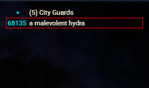
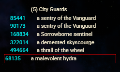
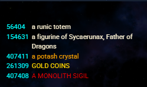
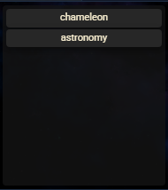
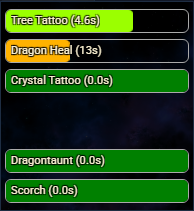
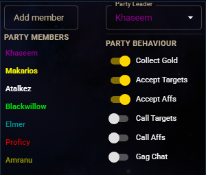
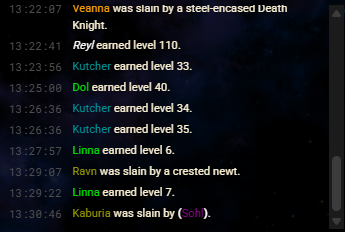
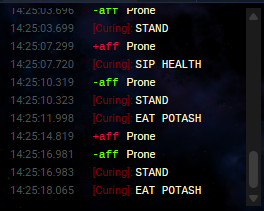
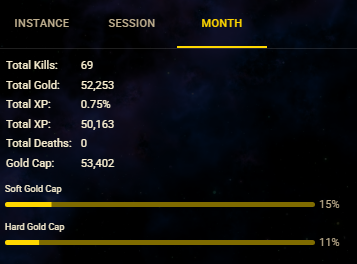

# Panels & tabs

nexGui4 registers a set of panels into the Nexus FlexLayout as docked tabs.
Each can be moved, floated, resized, and rearranged like any native Nexus tab,
and the arrangement can be persisted (see [Layout & presets](./layout.md)).

## Tab catalog

| Tab      | Panel         | Shows                                                      |
| -------- | ------------- | ---------------------------------------------------------- |
| Timers   | `nexTimers`   | Countdown / count-up timer bars.                           |
| Party    | `nexParty`    | Current party members and leader.                          |
| Players  | `nexPlayers`  | Players in the room, with a popover and targeting actions. |
| NPCs     | `nexNpcs`     | Room NPCs, grouped by category.                            |
| Items    | `nexItems`    | Room items, with a get / probe context menu.               |
| Stats    | `nexStats`    | Your body diagram and vitals bars.                         |
| System   | `nexSystem`   | The System side-stream transcript.                         |
| Combat   | `nexCombat`   | The Combat side-stream transcript.                         |
| Defences | `nexDefences` | Configured defences that are currently missing.            |
| Feed     | `nexFeed`     | The Achaea public game feed.                               |
| Target   | `nexTarget`   | Body diagram and limb damage for your current target.      |
| Options  | `nexOptions`  | The Game / Panels / Display / Advanced settings tabs.      |
| Metrics  | `nexMetrics`  | Runtime and diagnostic metrics.                            |

## Surfaces that are not tabs

Two surfaces mount differently and do not appear in the tab strip:

- **Main display** — replaces the host's native output area and renders the live
  game transcript. See [The main display & scrollback](./main-display.md).
- **Scrollback modal** — the full-buffer search window, opened by scrolling the
  wheel up over the main display. Also covered in
  [The main display & scrollback](./main-display.md).

## Players, NPCs, and items

The Players, NPCs, and Items panels read live room occupancy from `GMCP`.

- **Players** colors each name by city and relationship (ally, enemy,
  city-enemy) and offers a popover with targeting and lookup actions.
- **NPCs** groups room denizens into categories so large rooms stay readable,
  and supports per-NPC display overrides through
  [`nexGui.api.room.npcs`](../reference/api.md#nexguiapiroom).

  
  *The NPCs panel with grouped room denizens and current target highlighted.*

  
  *The NPCs panel in ungrouped mode.*

- **Items** lists ground items with quick get / probe actions, and supports
  per-item display overrides through [`nexGui.api.room.items`](../reference/api.md#nexguiapiroom).

  
  *The Items panel displaying room items.*

## Stats and target

The Stats and Target panels render a body diagram (limb state) plus vitals. The
Stats panel reflects your own character; the Target panel reflects your current
combat target and updates as target identity and limb damage change.

## Defences

The Defences panel shows the subset of your **configured** defences that are not
currently up, so you can re-establish them at a glance. The configured checklist
is editable through [`nexGui.api.customize.defences`](../reference/api.md#nexguiapicustomize).

*The Defences panel displaying missing defences.*

## Timers

The Timers panel displays countdown and count-up timer bars.

*The Timers panel displaying active countdown and count-up timers.*

## Party

The Party panel lists current party members, their vital status, and the selected leader.

*The Party panel with members and leader selected.*

## Feed

The Feed panel displays the Achaea public game feed.

*The Feed panel displaying the public live game feed.*

## Side streams

The System and Combat side streams provide dedicated transcripts for events and combat replacement rows.

*The System stream rendering events.*

## Metrics

The Metrics panel displays runtime diagnostic metrics.

*The Metrics panel with runtime diagnostics.*
