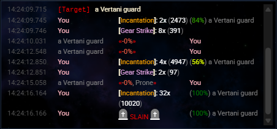

# Side streams

nexGui4 has two side-stream panels in addition to the main display:

- **System** (`nexSystem`)
- **Combat** (`nexCombat`)

Each is a separate transcript view backed by its own model. Normal host output
still flows through the main display; a row appears in a side stream only when
something explicitly routes a line into it.


*The System stream rendering defence and affliction events.*


*The Combat stream displaying skill replacement rows and target info.*

## The stream toggles persist UI state only

The **System Stream** and **Combat Stream** toggles on the
[Game options tab](./options.md#game) persist UI state. They do **not** by
themselves reroute arbitrary game output into the side streams. Lines appear in
a side stream when a supported event reaches the message pipeline, or when code
writes directly to the stream.

## Events that already render into streams

When these events reach the nexGui4 message pipeline, they produce side-stream
rows:

| Event | Stream | Renders |
| --- | --- | --- |
| `Char.Defences.Add` | System | a `+def` row |
| `Char.Defences.Remove` | System | a `-def` row |
| `Char.Afflictions.Add` | System | a `+aff` row |
| `Char.Afflictions.Remove` | System | a `-aff` row |
| `IRE.Target.Info` | Combat | a target status row |
| `nexSkillMatch` / `nexSkillNpcMatch` | Combat | a structured skill-replacement row |

If your message fits one of these contracts, raise the event and let the
existing bindings format it:

```js
eventStream.raiseEvent("Char.Defences.Add", {
  name: "rebounding",
  desc: "A shimmering shield surrounds you.",
});
```

:::caution `nexSkillMatch`

`nexSkillMatch` / `nexSkillNpcMatch` depend on the host replacement handler
running during live line processing. Raising them from arbitrary code outside a
live output block will not render a combat row — write the row directly instead.

:::

## Writing a custom row

For custom rows from scripts or other packages, use the public stream API:

```js
nexGui.api.stream.add({
  html: "<span>[note] something happened</span>",
  stream: "system", // or "combat"
});
```

- `html` is the trusted row markup.
- `stream` must be `"system"` or `"combat"`.
- A timestamp is generated and rendered by the panel; do not include timestamp
  markup in `html`.

See [`nexGui.api.stream`](../reference/api.md#nexguiapistream) for the full
contract.
