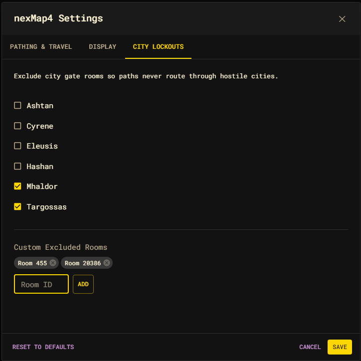

# City Lockouts settings

The City Lockouts tab keeps routes out of cities you are not welcome in. Each
city entry corresponds to that city's **gate rooms**; excluding a city adds its
gate rooms to the excluded-rooms set so pathfinding never routes through them.



## City toggles

Tick a city to exclude its gate rooms; untick it to allow them again. The
catalog covers the player cities:

- Ashtan
- Cyrene
- Eleusis
- Hashan
- Mhaldor
- Targossas

## Custom Excluded Rooms

Below the city list you can exclude any room by id. Enter a positive room id and
press **Add** (or Enter); excluded rooms appear as chips and can be removed
individually. These are independent of the city catalog — clearing a city does
not touch your custom exclusions.

## How exclusions affect routing

Both city gate rooms and custom rooms feed the same `excludedRoomIds` set in
your [settings](./index.md). At query time, any excluded room is given infinite
weight, so the shortest-path search prunes it — routes detour around it, and a
destination that is *only* reachable through excluded rooms returns no path.

```js
nexMap.settings.get().excludedRoomIds;   // current exclusions
```

This is the single weight authority for room exclusion — there is no separate
overlay. The same set is consulted whether you travel by `nm goto`, a map click,
or the API.
