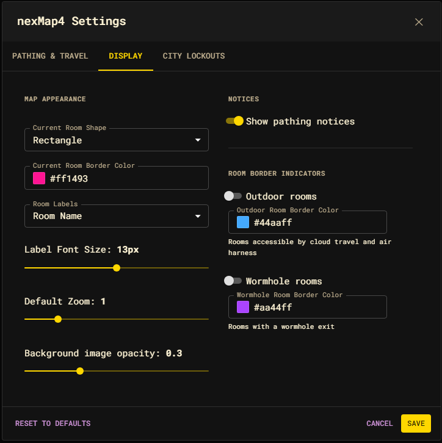

# Display settings

The Display tab controls how the map looks. These settings are presentation only
— they never affect routing.



## Map Appearance

| Setting | Default | Effect |
| --- | --- | --- |
| Current Room Shape | Rectangle | Shape drawn around your current room. Rectangle or Ellipse. |
| Current Room Border Color | `#ff1493` | Color of the current-room outline. Includes a color picker. |
| Room Labels | Room Name | What each room shows: **Room Name**, **Room ID**, or **Hidden**. |
| Label Font Size | 13px | Room-label text size (6–20px). |
| Default Zoom | 1 | Zoom level applied to the map (0.1–5). Previews live as you drag. |

## Background

| Setting | Default | Effect |
| --- | --- | --- |
| Background Image URL | (bundled wallpaper) | Optional image drawn behind the map. Clear it to remove. |
| Background Opacity | 0.3 | Opacity of the background image (0–1). |

You can also set the background from the command line:

```text
nm background https://example.com/image.jpg
nm background off
```

## Notices

| Setting | Default | Effect |
| --- | --- | --- |
| Show pathing notices | On | Show the snackbar toasts ("Pathing to …", "Arrived", "Path blocked") while a route runs. |

## Room Border Indicators

These draw a colored border around rooms that offer a fast-travel method, so you
can spot travel hubs at a glance. Both are **off** by default and each has its
own color picker.

| Indicator | Default color | Highlights |
| --- | --- | --- |
| Outdoor rooms | `#44aaff` | Rooms accessible by cloud travel and air harness. |
| Wormhole rooms | `#aa44ff` | Rooms with a wormhole exit. |
