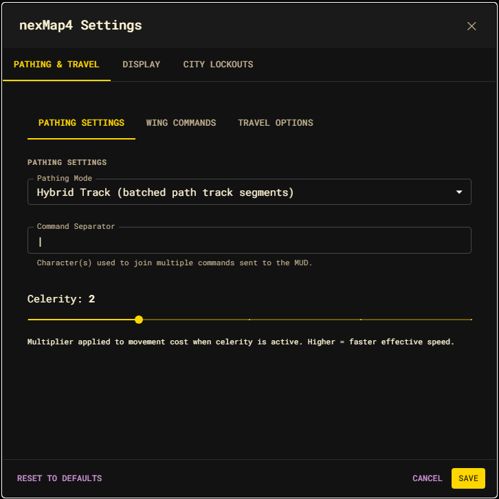
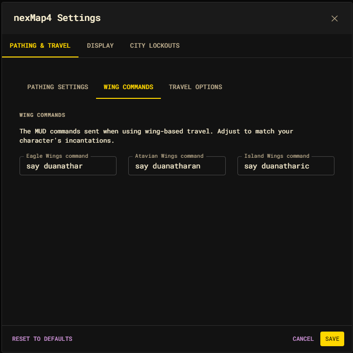
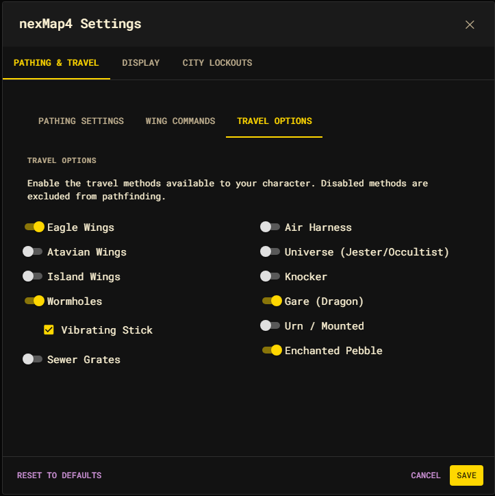

# Pathing & Travel settings

The first tab of the settings dialog controls how routes are executed and which
travel methods pathfinding may use.

## Pathing



| Setting | Default | Effect |
| --- | --- | --- |
| Pathing Mode | Hybrid Track | **Hybrid Track** batches eligible segments with Achaea's `path track`. **Client Step** sends one command per room, preserving room-by-room automation hooks. |
| Command Separator | `\|` | The character(s) used to join multiple commands sent to the MUD in one line. |
| Celerity | 2 | Movement-cost multiplier (1–5) applied when celerity is active. Higher = faster effective speed and routing that favors it. |

See [Travel and pathing](../travel.md) for how the two modes execute the same
computed route.

## Commands

The spoken incantations sent for wing-based travel. Adjust them to match your
character's abilities.



| Setting | Default |
| --- | --- |
| Eagle Wings command | `say duanathar` |
| Atavian Wings command | `say duanatharan` |
| Island Wings command | `say duanatharic` |

## Travel Options

Each switch enables a travel class for pathfinding. **Disabled methods are
excluded from routing** — their edges are pruned at query time. Enable only the
methods your character can actually use.



| Toggle | Travel class |
| --- | --- |
| Eagle Wings | `eagleWings` |
| Atavian Wings | `atavianWings` |
| Island Wings | `islandWings` |
| Wormhole | `wormhole` |
| Sewer Grate | `sewergrate` |
| Air Harness | `airHarness` |
| Universe | `universe` |
| Knocker | `knocker` |
| Gare | `gare` |
| Urn | `urn` |
| Pebble | `pebble` |

Most classes start **disabled** by default. The **Vibrating Stick** checkbox
(under Wormhole) toggles the vibrating-stick option used with wormhole travel.

You can flip the same toggles outside the dialog:

```text
nm wormholes on
nm clouds off
```

```js
nexMap.api.travel.enable("wormholes");
nexMap.api.travel.disable("clouds");
```

See [Travel and pathing](../travel.md) for the full class list and aliases.
