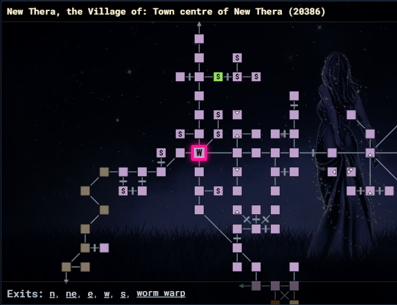

# The map interface

nexMap4 adds a dockable **map tab** to the Nexus client. The tab is a single
React surface with three persistent regions stacked vertically, plus overlay
dialogs that float above the map.



## Room header

The header at the top of the tab shows the current location, formatted as:

```text
Area Name: Room Name (roomId)
```

It reads from the live location snapshot, so it follows you as you move. Before
the graph resolves your room it reads `Loading room context`.

## The map

The map fills the space between the header and footer. It is a renderer-agnostic
SVG view of the current area slice (one z-level at a time).

| Interaction | Result |
| --- | --- |
| Drag | Pan the viewport. |
| Mouse wheel | Zoom in and out. |
| Click a room | Travel to that room. |

Room clicks are wired to travel by default through
`nexMap.connectRendererActions()`; an integration can repoint them at a
different command. The map reflects your **Display** settings — current-room
shape and color, room labels, label size, default zoom, the optional background
image, and the outdoor / wormhole border indicators. See
[Display settings](./configuration/display.md).

## Exits footer

The footer lists every exit of the current room as a clickable button
(`Exits: n, e, s, w, …`). Clicking an exit moves you that direction. Special
exits that resolve to a specific room (rather than a simple direction) travel to
that room's id instead. When the room has no recorded exits the footer reads
`Exits: none`.

## Overlay dialogs

Three dialogs float above the map and are opened from `nm` commands or the API:

| Dialog | Opened by | Contents |
| --- | --- | --- |
| **Settings** | `nm config` / `nexMap.api.system.openSettings()` | A modal with the Pathing & Travel, Display, and City Lockouts tabs. |
| **Shell** | `nm shell` / `nexMap.api.system.openShell(tab)` | A draggable window with the Landmarks, NPCs, and Help tabs. |
| **Results** | search commands / `nexMap.api.system.showResults(...)` | A draggable table of search hits; a row click travels to the hit. |

The settings dialog is **modal** — it edits a draft and you commit with **Save**
or discard with **Cancel**. The shell and results dialogs are **modeless** and
draggable, so you can keep them open beside the map while you play.

## Pathing notices

While a route runs, nexMap4 shows brief snackbar toasts at the bottom of the tab
("Pathing to room …", "Arrived at destination", "Path blocked"). These are
controlled by the **Show pathing notices** switch on the
[Display tab](./configuration/display.md).
