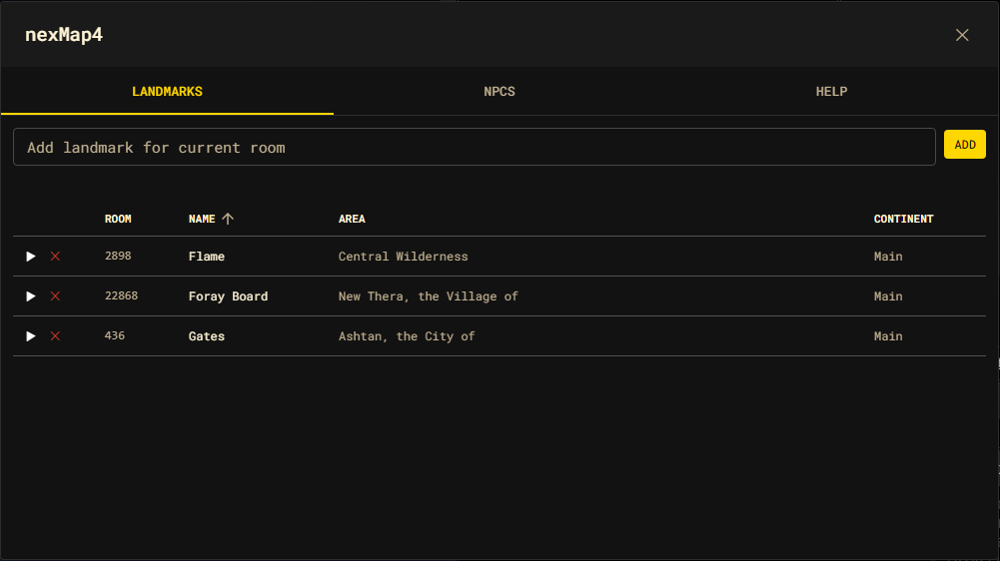

# Landmarks

A **landmark** is a named shortcut to a room. Once saved, you can travel to it by
name from anywhere on the graph. Landmarks are nexMap4-native and persist in your
[settings](./configuration/index.md).



## Saving a landmark

Saving captures the **current** room (or a room id you pass) along with its area
and continent, under a name you choose:

```text
nm mark home
```

```js
nexMap.api.landmarks.add("home");
nexMap.api.landmarks.add("bank", { roomId: 315 });
```

Names are case-insensitive and unique — saving a name that already exists
replaces the prior entry. Each landmark stores its `id`, `name`, `roomId`,
`areaName`, and `continent`.

## Traveling to a landmark

```text
nm goto home
```

```js
nexMap.api.travel.toLandmark("home");
```

`nm goto <name>` resolves landmarks too, so it is usually all you need.

## The Landmarks panel

Open the shell on the Landmarks tab to manage everything visually:

```text
nm marks        # opens the shell on the Landmarks tab
nm shell
```

```js
nexMap.api.landmarks.list();          // also opens the panel
nexMap.api.system.openShell("landmarks");
```

The panel is a sortable table of every saved landmark with **Room**, **Name**,
**Area**, and **Continent** columns. From here you can:

- **Add** a landmark for the current room using the form at the top.
- **Travel** to a landmark — click its row, or the ▶ button.
- **Delete** a landmark with the ✕ button.

## Removing a landmark

```text
nm unmark home
```

```js
nexMap.api.landmarks.remove("home");   // by name…
nexMap.api.landmarks.remove(landmarkId); // …or by id
```

## Where landmarks live

Landmarks are part of the persisted settings document (`settings.landmarks`),
written through `nexMap.settings`. Read the current list at any time:

```js
nexMap.settings.get().landmarks;
```
