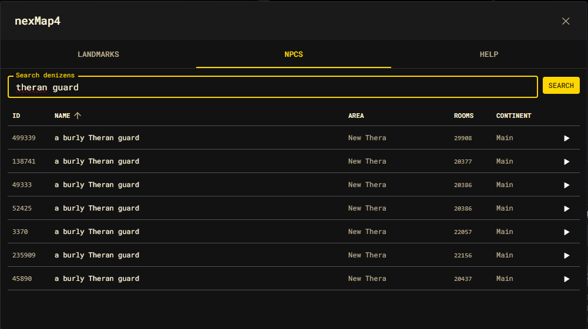

# NPC lookups

nexMap4 can look up **denizens** (NPCs) by name and route you to their known
rooms. Denizen data comes from a remote denizen service, so this feature
requires that service to be configured and reachable.



## Searching

```text
nm npc Orinula
```

```js
nexMap.api.search.denizens("Orinula", { showResults: true });
```

A match resolves to a denizen record with an `id`, `name`, the resolved `area`
(name and continent), and a `room` list of known room ids. nexMap4 enriches each
hit against the graph so the area and continent are filled in even when the
remote record is sparse.

## The NPC explorer panel

The NPC tab of the shell is an interactive search surface:

```text
nm shell
```

```js
nexMap.api.system.openShell("npcs");
```

Type a name and press **Search** (or Enter). Results appear in a sortable table
with **ID**, **Name**, **Area**, **Rooms**, and **Continent** columns. The
**Rooms** column shows the single room id when a denizen has one known location,
or a `N×` count when it roams.

| Action | Result |
| --- | --- |
| Click a row | Travel to the denizen's primary (first) known room. |
| Click ▶ | Travel to the next known room, cycling through all of them on repeated clicks. |

The cycling ▶ button is built for roaming denizens that appear in several rooms —
each press advances to the next location.

## Results dialog

When you run `nm npc <name>` from the command line (rather than the panel), the
hits open in the floating **Results** dialog with the same columns. A row click
closes the dialog and travels to the denizen's primary room.

## Requirements and behavior

- A denizen search with no configured remote client raises an error
  ("Denizen search requires a configured remote denizen client.").
- Searches are asynchronous; the panel shows a spinner while a query is in
  flight.
- A denizen with no known rooms cannot be traveled to — clicking it does nothing.
