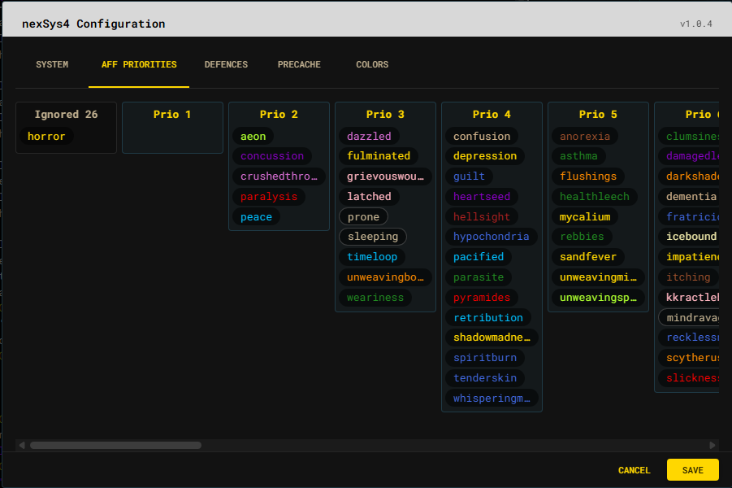

# Affliction priorities

The tab groups afflictions into numbered priority columns. Drag an affliction
to another column to change its default server-side curing priority.

- Priority `0` is shown as **Ignored**.
- Lower positive numbers are treated as more urgent by Achaea's server-side
  priority system.
- The horizontal layout scrolls when every priority column does not fit.
- Changes are drafts until **Save** is selected.

Saving changes the persisted default. A runtime rule may temporarily overlay a
different working priority without replacing that default. See
[Curing and priorities](../curing.md) for the distinction.

