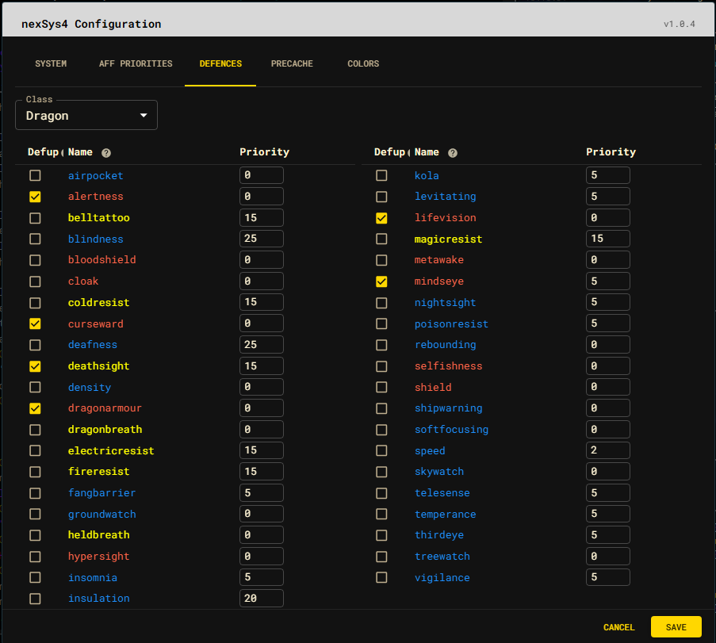

# Defences

Select a class to filter the defence list, then configure each defence:

- **Defup checked** means the defence is player-controlled and raised by the
  manual defence-up action.
- **Defup unchecked** leaves upkeep to server-side curing.
- **Priority** accepts values from `0` through `26`.

The name colors describe balance behavior:

| Color | Meaning |
| --- | --- |
| Red | Activating the defence uses balance or equilibrium. |
| Yellow | Activation is free but requires balance or equilibrium. |
| Blue | Activation is a free action. |

Color is guidance rather than a priority setting. Review class-specific needs
before copying another character's configuration.

