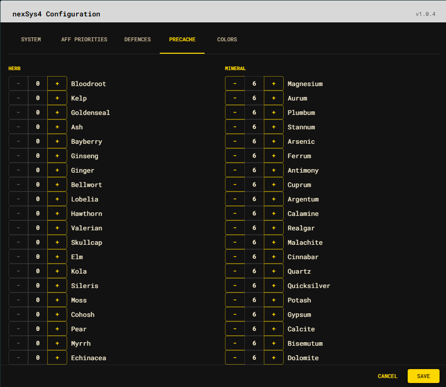

# Precache

Precache targets tell nexSys4 how many curatives to keep available. Herbs and
their mineral equivalents are presented side by side.

- Use **+** and **-** to change a desired quantity.
- Quantities cannot be negative.
- Set an item to `0` when it should not be precached.
- Changes are persisted only after **Save**.

The desired target is not an inventory claim. Live inventory and rift counts
remain visible under `nexSys.state.cache`, while the output planner determines
what must be retrieved to reach the desired target.

