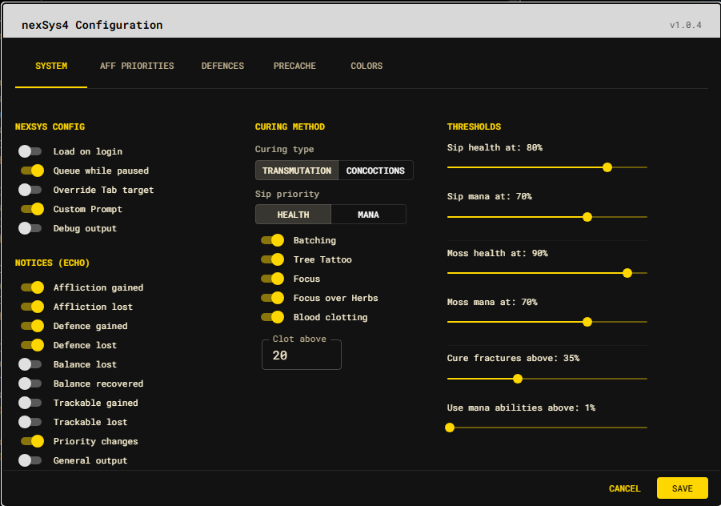

# System settings

## nexSys configuration

| Setting | Default | Effect |
| --- | --- | --- |
| Load on login | Off | Load the saved configuration during login startup. |
| Queue while paused | Off | Permit queued work while the runtime is paused. |
| Override Tab target | Off | Let nexSys4 provide the target-oriented Tab behavior. |
| Custom Prompt | On | Enable the nexSys4 prompt renderer. |
| Debug output | Off | Enable additional diagnostic output. |

## Notices

Notices control what nexSys4 echoes locally. Affliction gained/lost, defence
gained/lost, and priority-change notices are enabled by default. Balance,
trackable, and general-output notices are disabled by default.

These switches affect local presentation; they do not stop the underlying
state update or public event.

## Curing method

| Setting | Default | Effect |
| --- | --- | --- |
| Curing type | Transmutation | Select Transmutation or Concoctions terminology for server-side curing. |
| Sip priority | Health | Choose the resource preferred when both health and mana need a sip. |
| Batching | On | Ask server-side curing to batch compatible actions. |
| Tree Tattoo | On | Permit tree tattoo use. |
| Focus | On | Permit focus curing. |
| Focus over Herbs | On | Prefer focus where the server supports that choice. |
| Blood clotting | On | Permit clotting above the configured reserve. |
| Clot above | 19 | Keep at least this much mana while clotting. |

## Thresholds

Thresholds are percentages unless the control says otherwise.

| Setting | Default |
| --- | ---: |
| Sip health at | 80% |
| Sip mana at | 70% |
| Moss health at | 90% |
| Moss mana at | 80% |
| Cure fractures above | 35% |
| Use mana abilities above | 10% |

Saving updates the local baseline and reconciles only the necessary changes
with the server-side curing configuration.

